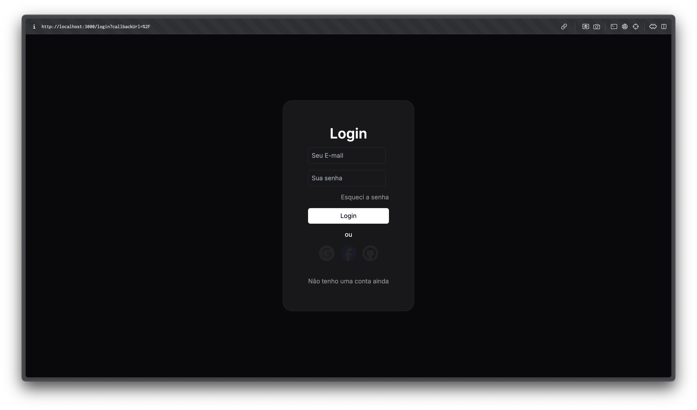

<p align="center">
  
</p>

&nbsp;

[](https://nextjs.org)
[](https://next-auth.js.org)
[](https://www.prisma.io)
[](https://sqlite.org)

Template de login usando Next js

## Principais características

* Login com providers (Google, Facebook, GitHub)
* Login com credencias (Email e senha)
* Alterar dados
* Excluir conta
* Logout
* Role
* Upload de imagem
* Esqueci a senha

## Como usar

Para clonar e executar este aplicativo, você precisará [Git](https://git-scm.com) e [Node.js](https://nodejs.org/en/download/) (que vem com [npm](http://npmjs.com)) instalado no computador. A partir da sua linha de comando:

```bash
# Clonar este repositório
$ git clone https://github.com/carlosallberto/next-auth-starter

# Ir para o repositório
$ cd next-auth-starter

# Instalar dependências
$ npm install

# Migrar tabela do banco de dados
$ npx prisma migrate dev --name init

# Executar o aplicativo
$ npm run dev
```

> **Nota**
> Se você estiver usando o Linux Bash para Windows, [veja este guia](https://www.howtogeek.com/261575/how-to-run-graphical-linux-desktop-applications-from-windows-10s-bash-shell/) ou use 'node' no prompt de comando.


## Contribuindo

As contribuições são o que tornam a comunidade de código aberto um lugar incrível para aprender, inspirar e criar. Quaisquer contribuições que você fizer são **muito apreciado**.

Se você tiver uma sugestão que melhore isso, por favor, bifurque o repositório e crie uma solicitação pull. Você também pode simplesmente abrir um problema com a tag "enhancement".
Não se esqueça de dar uma estrela ao projeto! Obrigado mais uma vez!

1. Fork the Project
2. Create your Feature Branch (`git checkout -b feature/AmazingFeature`)
3. Commit your Changes (`git commit -m 'Add some AmazingFeature'`)
4. Push to the Branch (`git push origin feature/AmazingFeature`)
5. Open a Pull Request

## Emailware

Se você gostou de usar este aplicativo ou ele tem ajudado você de alguma forma, eu gostaria que você me envie um e-mail em <dasilvacarlosalberto344@gmail.com> sobre qualquer coisa que você gostaria de dizer sobre este software. Eu realmente apreciaria isso!

## Creditos

Este software usa os seguintes pacotes de código aberto:

- [Next.js](https://nextjs.org)
- [NextAuth](https://next-auth.js.org)
- [Prisma](https://www.prisma.io)
- [SQLite](https://sqlite.org)

## Suporte

<a href="https://www.buymeacoffee.com/CarlosAllberto" target="_blank"></a>

## Licença

Distribuído sob a Licença MIT. Ver `LICENSE.txt` para mais informações.

&nbsp;

---

> GitHub [/carlosallberto](https://github.com/carlosallberto) &nbsp;&middot;&nbsp;
> Instagram [@carlosalberto.dev](https://instagram.com/carlosalberto.dev)
